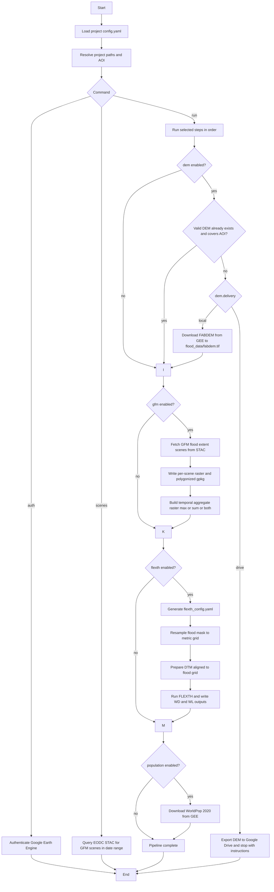
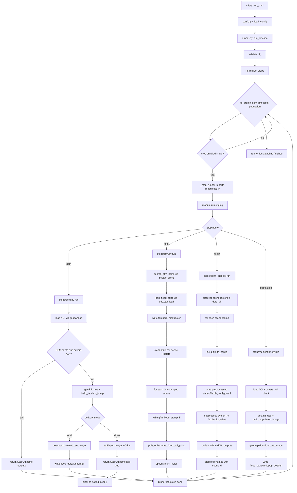

# Flood Pipeline Workflow
## User Workflow

This diagram summarizes the main execution flow of the project, including optional and conditional branches.

## Developer workflow (code-level)

This chart shows how the code executes the pipeline internally, from CLI entrypoint to step modules and artifacts.

