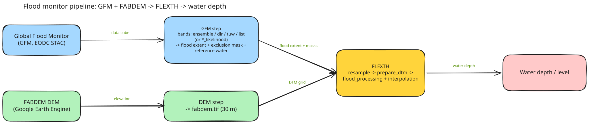

# Flood Monitor & Water Depth Pipeline

One pipeline from raw inputs to water-depth maps: **FABDEM DEM** (Google Earth
Engine) + **GFM flood extent** (EODC STAC) + **FLEXTH water depth/level**
([FLEXTH fork](https://github.com/kwundram2602/FLEXTH), based on
[hyunholee26/FLEXTH](https://github.com/hyunholee26/FLEXTH)).
The app is driven by a
single `config.yaml` and a Streamlit dashboard.

## Quick start

```bash
uv sync

uv run flood-pipeline dashboard
```



